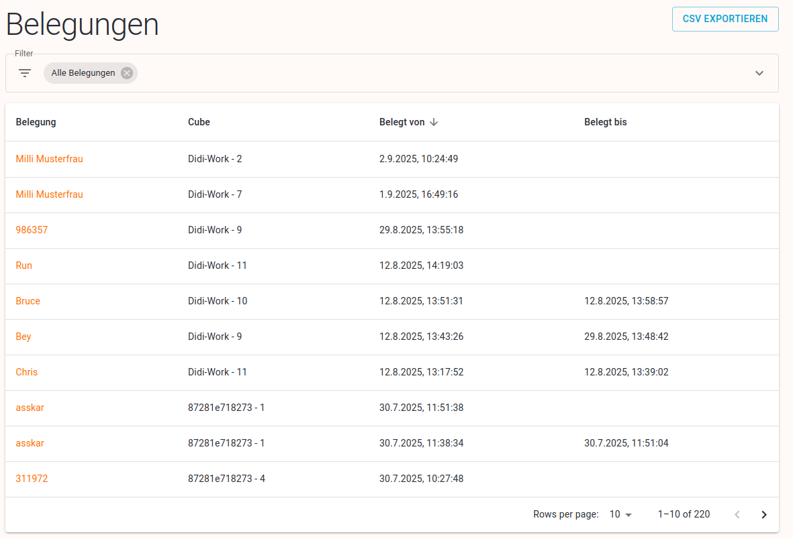
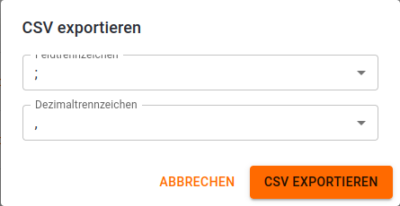

# Belegungen

# Tabelle

Folgende Spalten werden in der Tabelle angezeigt:

- Belegung: zeigt den Namen des Enlehners an (wenn es den nicht gibt, wird die E-Mail angezeigt, sonst die Telefonnummer, sonst das Konto und wenn es den auch nicht gibt, dann der Buchungscode). Mit Verlinkung zu [Belegunsdetail](https://www.notion.so/Belegung-Detail-262add09e873804ba051d5a231f1fd02?pvs=21).
- Cube: zeigt die Cube-ID und die Fachnummer an
- Belegt von: Datum wann die Belegung begonnen hat
- Belegt bis: Datum wann die Belegung beendet wurde. Ist dieses Feld leer, dann ist das Fach aktuell belegt.

## Filter für die Tabelle

Der Filter kann mit eine Klick auf das Filtersymbol oder Pfeilchen geöffnet bzw. geschlossen  werden.

Die Tabelle kann nach folgenden Kriterien gefiltert werden:

- Zeitraum: alle, heute, gestern, letzten 7 Tage, letzte Woche, diesen Monat, dieses Jahr, letzten Monat, letzte 3 Monate, letztes Jahr, benutzerdefiniert.
- Von-Bis: Bei Auswahl von "benutzerdefiniert" im Zeitraum-Filter können Start- und Enddatum manuell eingetragen werden.
- Standort: Ohne Auswahl eines Standorts werden Buchungen von allen Standorten des Mandanten angezeigt.
- Belegungs-Status: entweder alle Belegungen oder nur die aktuellen Belegungen angzeigen.

# CSV Exportieren

Mit dieser Funktion lässt sich die Tabelle als CSV-Datei exportieren. Es werden nur die Einträge exportiert, die aktuell am Bildschirm angezeigt werden (entsprechend der gesetzten Filter).

Bevor die Datei erzeugt wird, kann der Benutzer festlegen, welche Trenn- und Dezimalzeichen in der CSV-Datei verwendet werden sollen.

AbfrageTrenn- und Dezimalzeichen

Beispiel für eine CSV-Datei

Folgende Spalten werden exportiert:

- id (ID der Belegung)
- accessCode (Buchungscode)
- cubeId (ID des Cubes)
- boxNumber (Fachnummer)
- occupiedFrom (Datum wann die Belegung begonnen hat)
- occupiedUntil (Datum wann die Belegung beendet wurde)
- releasedAt (Datum wann das Fach freigeben wurde)
- openedTimes (wie oft das Fach geöffnet wurde)
- bookingUuid (Buchungs-ID zu der die Belegung gehört)