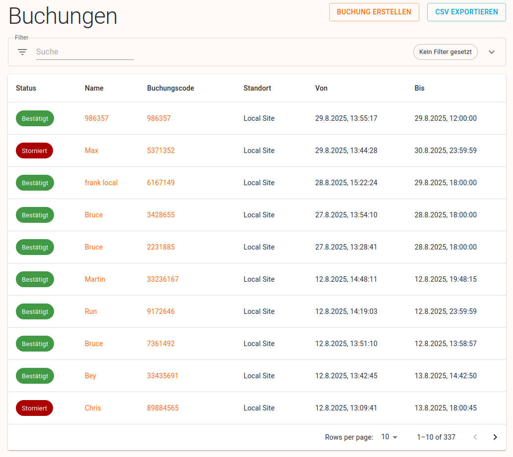
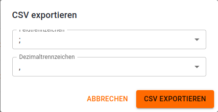

# Buchungen

Buchungen Tabelle - Übersicht

# Tabelle

Folgende Spalten werden in der Tabelle angezeigt:

- Status: der Status der Buchung
- Name: zeigt den Namen des Enlehners an (wenn es den nicht gibt, wird die E-Mail angezeigt, sonst die Telefonnummer, sonst das Konto und wenn es den auch nicht gibt, dann der Buchungscode). Mit Verlinkung zu [Buchungsdetail](https://www.notion.so/Buchung-Detail-261add09e87380eb95fad28479ea3e7e?pvs=21)
- Buchungscode: mit Verlinkung zu [Buchungsdetail](https://www.notion.so/Buchung-Detail-261add09e8738046b43fef46c77e0af3?pvs=21)
- Standort
- Von-Bis: Zeitraum der Buchung

## Filter für die Tabelle

Buchungen-Tabelle mit Filter

Der Filter kann mit eine Klick auf das Filtersymbol oder Pfeilchen geöffnet bzw. geschlossen  werden.

Die Tabelle kann nach folgenden Kriterien gefiltert werden:

- Zeitraum: alle, heute, gestern, letzten 7 Tage, letzte Woche, diesen Monat, dieses Jahr, letzten Monat, letzte 3 Monate, letztes Jahr, benutzerdefiniert.
- Von-Bis: Bei Auswahl von "benutzerdefiniert" im Zeitraum-Filter können Start- und Enddatum manuell eingetragen werden.
- Standort: Ohne Auswahl eines Standorts werden Buchungen von allen Standorten des Mandanten angezeigt.
- Status: Ohne Auswahl werden alle Buchungen unabhängig von ihrem Status angezeigt.

Zusätzlich zu den auswählbaren Filtern gibt es auch eine Volltextsuche. Damit können die ausgewählten Filter weiter verfeinert werden. 

# Buchung erstellen

Siehe “[Buchung erstellen](https://www.notion.so/Buchung-erstellen-261add09e87380b68c26d81b4cbb3956?pvs=21)”. 

# CSV Exportieren

Mit dieser Funktion lässt sich die Tabelle als CSV-Datei exportieren. Es werden nur die Einträge exportiert, die aktuell am Bildschirm angezeigt werden (entsprechend der gesetzten Filter).

Bevor die Datei erzeugt wird, kann der Benutzer festlegen, welche Trenn- und Dezimalzeichen in der CSV-Datei verwendet werden sollen.

AbfrageTrenn- und Dezimalzeichen

Beispiel für eine CSV-Datei (Spalten nicht vollsändig)

Folgende Spalten werden exportiert:

- uuid	(ID)
- bookingCode (Buchungscode)
- from (von)
- until (bis)
- site (Standort)
- boxes (Fächer)
- name (Name)
- email (E-Mail)
- phone (Mobilnummer)
- amount (Betrag)
- discountCode (Rabatt-Code)
- cardUid (Karten ID)
- locale (Sprache)
- source (Quelle - online oder Cube)
- paidAt (wann bezahlt wurde)
- paymentNote
- createdAt (wann die Buchung erstellt wurde)
- firstOccupiedAt (Datum der Erstbelegung)
- lastOccupiedAt (Datum der letzten Belegung)
- occupancies (Anzahl der Belegungen)