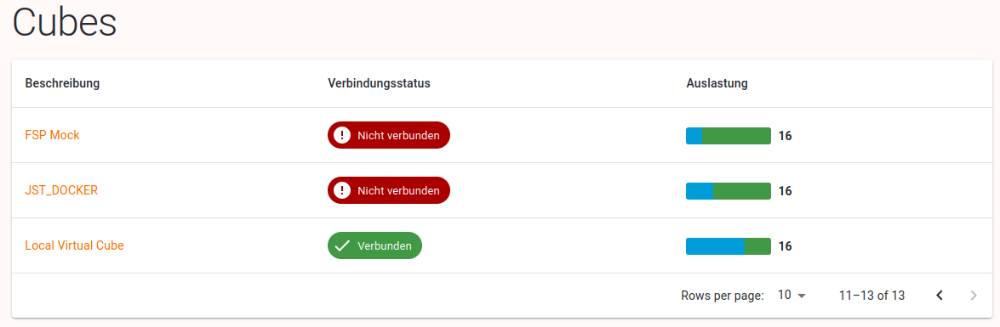

# Cubes

# Cubes Tabelle

Folgende Spalten werden in der Cubes Tabelle angezeigt:

- Beschreibung: die Beschreibung, die im Cubeadmin Center eingetragen ist. Ist eine Verlinkung zu [Cube Detail](https://www.notion.so/Cubes-F-cher-Tab-263add09e8738001a009e14b63858213?pvs=21).
- Verbindungsstatus: zeigt an, ob der Controller verbunden ist oder nicht.

- Auslastung: zeigt grafisch an, wieviele Fächer belegt bzw. verfügbar sind und wieviele insgesamt zur Verfügung stehen. Ein Tooltip zeigt genau an, wieviele Fächer noch verfügbar sind.

Tooltip Anzeige bei der Auslastung