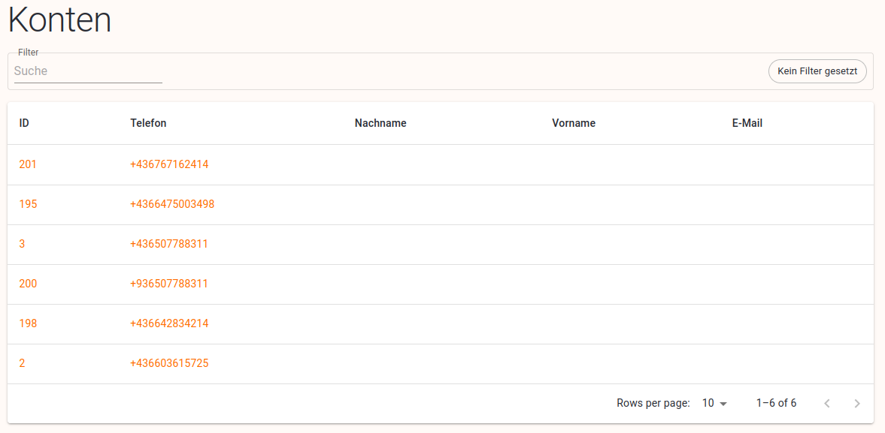

# Konten

Werden immer automatisch registriert (im Unterschied zu Benutzer, die manuell angelegt werden).

Zum Beispiel bei Safecube-Keycard, sobald jemand seine Mobilnummer angibt, wird ein Konto angelegt. 

Ein anderes Beispiel ist [safecube.io](http://safecube.io). Auch dort gibt man die Mobilnummer ein. Dann wird eine SMS verschickt mit einem Link der einen Token beinhaltet. Mit diesem Link kommt man in seine Keycard, die mit der Telefonnummer verbunden ist. Kann man sich vorstellen, als Login ohne Password.

# Tabelle

Folgende Spalten werden in der Tabelle angezeigt:

- ID (Verlinkung zu [Konto Detailansicht](https://www.notion.so/Konto-Detail-262add09e873801fb60bff82661793cb?pvs=21))
- Telefon (Verlinkung zu [Konto Detailansicht](https://www.notion.so/Konto-Detail-262add09e873801fb60bff82661793cb?pvs=21))
- Nachname
- Vorname
- E-Mail

## Filter für die Tabelle

Volltextsuche, die nach Vorname, Nachname, Telefonummer und E-Mail sucht (nicht nach ID).